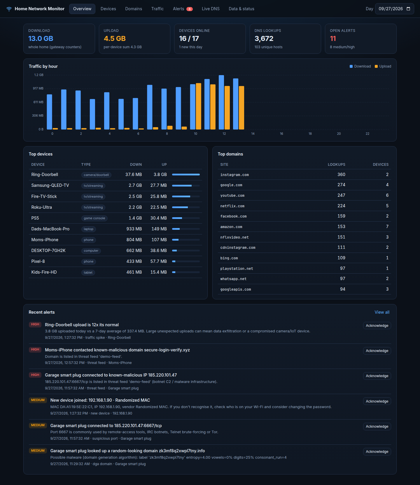

# Home Network Monitor

A self-hosted app that watches everything on your home Wi-Fi and wired network
and answers:

1. **What's connected?** Computers, phones, tablets, TVs and streaming sticks,
   game consoles, smart speakers, cameras and small IoT gadgets, with vendor
   and device type identified automatically.
2. **What is each device talking to?** Every domain/host looked up, per device,
   plus remote hosts and ports when traffic capture is available. It records
   *where* traffic goes, not the traffic content.
3. **How much upload/download per day?** Whole-home totals from the AT&T
   gateway's WAN counters, plus per-device totals when capture is available.
4. **Anything suspicious?** New/unknown devices, known-malware domains and
   IPs (abuse.ch threat feeds), random-looking "DGA" domains, DNS-tunneling
   patterns, bursts of failed lookups, risky ports (Telnet, IRC botnets, Tor,
   RDP/VNC), devices bypassing your DNS, and upload/download spikes vs. each
   device's own 7-day baseline.
5. **History for later analysis.** Everything is stored in one SQLite file,
   browsable in the dashboard and exportable as CSV.

It is designed around **AT&T Fiber / Internet 1000 with an AT&T gateway**
(BGW320, BGW210, Pace 5268AC, NVG599), default network `192.168.1.0/24` with
the gateway at `192.168.1.254`.



---

## Try it in 30 seconds (no network changes)

Requires Python 3.9 or newer. On macOS the command is `python3` (there is no
`python` until you activate the virtual environment). If `python3` isn't
found, run `xcode-select --install` or `brew install python`.

```bash
git clone https://github.com/darshangr/AI-understanding.git
cd AI-understanding/home-network-monitor
python3 -m venv .venv
source .venv/bin/activate        # from here on, "python" works
pip install -r requirements.txt
python -m netmon demo            # then open http://127.0.0.1:8080
```

Press Ctrl+C to stop. Next time, just `cd` into the folder, run
`source .venv/bin/activate`, then `python -m netmon demo`.

Demo mode serves a month of synthetic data for a 17-device household, with a
few planted problems: a smart plug calling out to a botnet IP and random
domains, a doorbell camera uploading 12x its normal amount, a phishing lookup
and an unknown device joining.

---

## How it sees your network

The AT&T gateway can't export per-device traffic or DNS logs, so the monitor
combines several sources. Enable the ones that fit your setup:

| Source | What it gives you | What it needs |
|---|---|---|
| **LAN discovery** (ARP scan) | Devices online now, IP, MAC, vendor, device type | Nothing; runs on any box on your LAN |
| **AT&T gateway scraper** | Gateway's device list (names, Wi-Fi band, on/off), **WAN byte counters for whole-home daily totals** | Nothing; reads `192.168.1.254` pages that don't require login |
| **Built-in DNS server** | **Every domain every device looks up** | Devices must use the monitor as their DNS server (Step 2) |
| Pi-hole / AdGuard Home import | Same as above, from an existing install | Pi-hole v5/v6 or AdGuard Home |
| **Packet sniffer** | Per-device upload/download, remote hosts, TLS server names, DHCP hostnames | Root. Full traffic only on a switch mirror port or if the box is your router |
| **NetFlow v5 receiver** | Per-device upload/download and remote hosts | Your own router behind the AT&T gateway exporting NetFlow |

What's realistic at each level of effort:

| Setup | Devices | Domains per device | Whole-home GB/day | Per-device GB/day |
|---|---|---|---|---|
| **Level 1:** Pi on LAN, no changes | ✅ | only devices you manually point at it | ✅* | ❌ |
| **Level 2:** + monitor becomes everyone's DNS | ✅ | ✅ | ✅* | ❌ |
| **Level 3:** + your own router or mirror port | ✅ | ✅ | ✅ | ✅ |

\* From the gateway's WAN byte counters. Gateway firmware versions differ;
the *Data & status* tab shows whether counters were found. If not, the
whole-home total is the sum of per-device traffic (Level 3).

---

## Step 1: Install on an always-on box (Level 1)

Use a Raspberry Pi 4/5, a mini PC, a NAS with Docker, or an old laptop running
Linux. **Plug it into the AT&T gateway with Ethernet.**

1. **Give it a fixed IP.** In the gateway UI (`http://192.168.1.254`, device
   access code is on the gateway's sticker): *Home Network → IP Allocation* →
   find the Pi → *Allocate* a fixed address, e.g. `192.168.1.10`.
2. **Configure:**

   ```bash
   git clone <this repo> && cd <repo>/home-network-monitor
   cp config.example.yaml config.yaml     # set timezone; defaults fit AT&T
   cp .env.example .env                   # set NETMON_DASHBOARD_PASSWORD
   ```

3. **Run with Docker** (recommended):

   ```bash
   docker compose up -d --build
   ```

   **Or directly** (systemd unit in `deploy/netmon.service`):

   ```bash
   python3 -m venv .venv && .venv/bin/pip install -r requirements.txt
   set -a; . ./.env; set +a
   sudo -E .venv/bin/python -m netmon run -c config.yaml
   ```

4. Open `http://192.168.1.10:8080` from any device at home.
5. Optional: `python -m netmon update-oui` downloads the full IEEE vendor
   list for better device identification.

For the first 48 hours (`learning_period_hours`) new devices are logged as
*info*. After that, a device joining your network raises a *medium* alert.

## Step 2: Make the monitor your DNS server (Level 2)

This gives you "every domain every device hits". The built-in DNS server
(`collectors.dns_proxy`, enabled in the example config) forwards lookups to
Quad9/Cloudflare, or to AT&T if you prefer, and logs who asked for what.

Note that **AT&T gateways don't let you change the DNS server they hand out
over DHCP.** Pick one of these workarounds:

**Option A: per device (quickest, partial).** Set DNS manually to
`192.168.1.10` on the computers, phones and tablets you care about (Wi-Fi
settings → Configure DNS → Manual). TVs and IoT gadgets usually can't do this.

**Option B: move DHCP to the monitor (whole network, recommended).**
1. Install dnsmasq on the monitor and copy `deploy/dnsmasq-dhcp.conf` to
   `/etc/dnsmasq.d/` (it's DHCP-only; netmon keeps port 53). Set
   `collectors.discovery.dhcp_leases_file: /var/lib/misc/dnsmasq.leases` so
   device hostnames come through.
2. In the gateway UI: *Home Network → IPv4* → set **DHCP Server** to **Off**
   and save.
3. Reboot or reconnect devices so they pick up new leases with the monitor as
   DNS.
4. IPv6: the gateway also advertises its own IPv6 DNS server, which lets
   devices skip yours. If you want complete coverage, set *Home Network →
   IPv6 → IPv6* to **Off**. The internet still works fine over IPv4.

   > If the monitor goes down under Option B, new devices can't get an IP
   > address. To undo, just turn the gateway's DHCP server back on.

**Option C: already have Pi-hole or AdGuard Home?** Disable `dns_proxy`, then
enable `collectors.pihole` or `collectors.adguard` and put the credentials in
`.env`. Pi-hole's own DHCP server can replace dnsmasq in Option B.

**Things that bypass DNS monitoring, and how the app handles them:**
- *Firefox DNS-over-HTTPS* and *iCloud Private Relay*: the built-in DNS server
  answers their official opt-out "canary" domains, so they fall back to normal
  DNS automatically (`disable_doh_canaries`).
- *Android "Private DNS"*, Chrome "Secure DNS", and hard-coded resolvers
  (some Chromecasts, Rokus): if traffic capture is on, the app raises a
  **dns_bypass** alert naming the device. Otherwise, turn these off in the
  device's settings.

## Step 3: Per-device bandwidth (Level 3)

Traffic between a device and the internet passes only through the AT&T
gateway, so the monitor needs to be in that path or see a copy of it:

**Option A: your own router behind the AT&T gateway (best).**
1. Connect a router that runs OpenWrt, pfSense/OPNsense, or similar to the
   gateway, and turn off the gateway's Wi-Fi.
2. In the gateway UI: *Firewall → IP Passthrough* → Allocation Mode
   **Passthrough**, Passthrough Mode **DHCPS-fixed**, and choose your router.
3. On the router, set the DHCP DNS server to the monitor's IP (this also
   replaces Step 2), and export **NetFlow v5 from the LAN interface** to
   `<monitor-ip>:2055`:
   - OpenWrt: `opkg install softflowd`, then set `interface=br-lan`,
     `host_port=192.168.1.10:2055`, `export_version=5`.
   - pfSense/OPNsense: install the softflowd package, choose interface LAN,
     host `192.168.1.10`, port `2055`, version 5.
4. Set `collectors.netflow.enabled: true`, and set `lan.cidr` to your router's
   LAN subnet.

**Option B: a managed switch with port mirroring.** Put a switch between the
gateway and *everything else*, including an access point (with the gateway's
Wi-Fi turned off). Mirror the uplink port to the monitor's port and set
`collectors.sniffer.enabled: true`. Wi-Fi devices connected directly to the
gateway's own radio can't be seen this way.

Even without Level 3, enabling the sniffer on a plain LAN port helps: it picks
up DHCP hostnames and mDNS/AirPlay/Chromecast announcements, which improve
device naming.

---

## The dashboard

- **Overview:** today's download/upload, devices online, DNS lookups, open
  alerts, traffic by hour, top devices, top sites.
- **Devices:** everything ever seen on the network with online status, vendor,
  type, IP/MAC, data used and lookups. Click a device to rename it, set its
  type, mark it trusted, and see its 30-day traffic, domains, remote hosts and
  alerts.
- **Domains:** every host looked up, grouped by site or not, filterable by
  device and period. Hosts seen for the first time are tagged **new**.
- **Traffic:** daily upload/download for 14 days to a year, and per-device
  totals.
- **Alerts:** severity-ranked findings with explanations; acknowledge when
  handled.
- **Live DNS:** a rolling log of lookups as they happen.
- **Data & status:** CSV exports (devices, daily traffic, domains, raw DNS
  log, remote hosts, alerts) and collector health.

## Data & retention

All data lives in `data/netmon.sqlite3`. You can open it with
[DB Browser for SQLite](https://sqlitebrowser.org/), `sqlite3`, or pandas:

```python
import sqlite3, pandas as pd
con = sqlite3.connect("data/netmon.sqlite3")
pd.read_sql("SELECT day, device, bytes_up, bytes_down FROM traffic_daily", con)
```

| Table | Contents | Kept |
|---|---|---|
| `devices` | every device seen, names, vendor, type | forever |
| `traffic_daily` / `wan_daily` | per-device / whole-home bytes per day | forever |
| `domain_stats` | lookups per device per domain per day | forever |
| `dns_queries` | every individual lookup | 30 days |
| `traffic_hourly` | per-device bytes per hour | 90 days |
| `host_traffic` | per-device remote IP/port/bytes per day | 180 days |
| `alerts` | all findings | forever |

Retention periods are set in `config.yaml → retention`.

## Security notes

- The dashboard requires a password (`NETMON_DASHBOARD_PASSWORD`) whenever it
  listens on anything other than localhost. Keep it on your LAN; don't
  port-forward it to the internet.
- Secrets are read only from environment variables, never from the config
  file.
- The container and systemd unit get only `NET_RAW`, `NET_ADMIN` and
  `NET_BIND_SERVICE`.
- Browsing history is sensitive. Let your household know the network is
  monitored, and reduce `retention.raw_dns_days` if you only need summaries.

## Development

```bash
pip install -r requirements-dev.txt
python -m pytest
```

Layout: `netmon/collectors/` (data sources), `netmon/anomaly.py` (detection
rules), `netmon/db.py` (storage), `netmon/web/` (API + dashboard),
`netmon/demo.py` (synthetic data).
